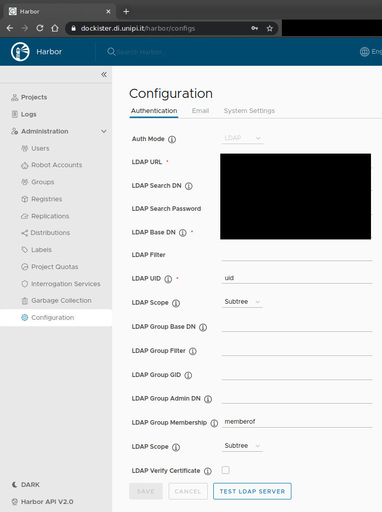

# Private Docker Registry
This is the documentation of the private docker registry at [dockister.di.unipi.it](dockister.di.unipi.it) 
using [Harbor](https://goharbor.io/) and [Let Encrypt](https://letsencrypt.org/).

- [Private Docker Registry](#private-docker-registry)
  - [Usage](#usage)
    - [Push](#push)
    - [Pull](#pull)
    - [Login](#login)
  - [Installation](#installation)
    - [Setup Certificate](#setup-certificate)
    - [Install Harbor](#install-harbor)
    - [Setup LDAP authentication](#setup-ldap-authentication)
    - [Manage repositories](#manage-repositories)
  - [Notes](#notes)
    - [Manage repositories](#add-replication-to-github)
      
 ## Usage 

### Push
```bash
git clone https://github.com/Unipisa/test-github-docker-registry.git
cd test-github-docker-registry
docker build -t test .
docker tag test dockister.di.unipi.it/test/test:v0 
docker push dockister.di.unipi.it/test/test:v0
```

### Pull
```bash
docker pull dockister.di.unipi.it/test/test:v0
```

### Login
```bash
docker login dockister.di.unipi.it --username a040515
```

## Installation

### Setup Certificate
```bash
sudo snap install --classic certbot
sudo ln -s /snap/bin/certbot /usr/bin/certbot
certbot certonly --standalone -d dockister.di.unipi.it
```
### Install Harbor

```bash
sudo usermod -aG docker $USER
sudo systemctl stop apache2
sudo systemctl disable apache2
 curl -s https://api.github.com/repos/goharbor/harbor/releases/latest | grep browser_download_url | cut -d '"' -f 4 | grep '\.tgz$' | wget -i -
tar xvzf harbor-offline-installer*.tgz
cd harbor
nano harbor.yml
```
edit with

```
hostname: dockister.di.unipi.it

https:
  port: 443
  certificate: /etc/letsencrypt/live/dockister.di.unipi.it/fullchain.pem
  private_key: /etc/letsencrypt/live/dockister.di.unipi.it/privkey.pem

database:
  password: $STRONG_PASS

data_volume: $SOME_DIR
```
then install with

```bash
sudo ./install.sh
```

and run with

```
docker-compose up -d
```

### Setup LDAP authentication

By web gui go to setting, configuration



### Manage repositories

By web gui


### Notes

#### Add replication to GitHub

```
docker exec -u 0 -it 17d3498715b0 bash
$ echo "140.82.121.34 ghcr.io" >> /etc/hosts
```
where `17d3498715b0` is for `goharbor/harbor-core`
